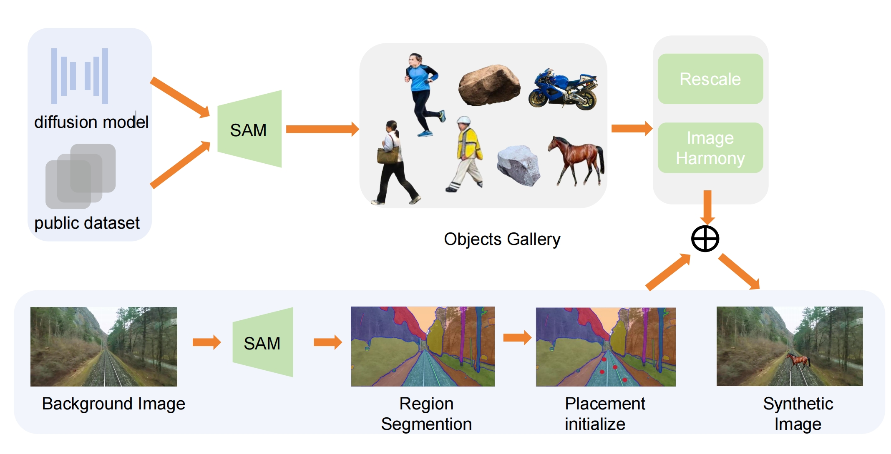

# SynRailObs

## A synthetic dataset on Obstacle detection in Railway scenario

## Introduction


## project structure
```
SynRailObs
|-images
  |- bg
  |- obj
|-models
  |-yolo5s.pt
  |-sam_vit_h.pth
|-sam-extract-obj.py
|-gen.ipynb
```
bg: background images and corresponding json files, which are annotations
of railway areas
obj: potential obstacles  
sam-extract-obj.py: extract obj from obj images based on points prompts
gen: generate synthetic images based on objs and background images
