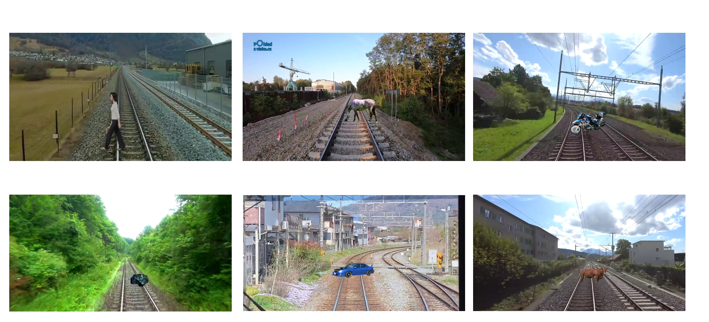
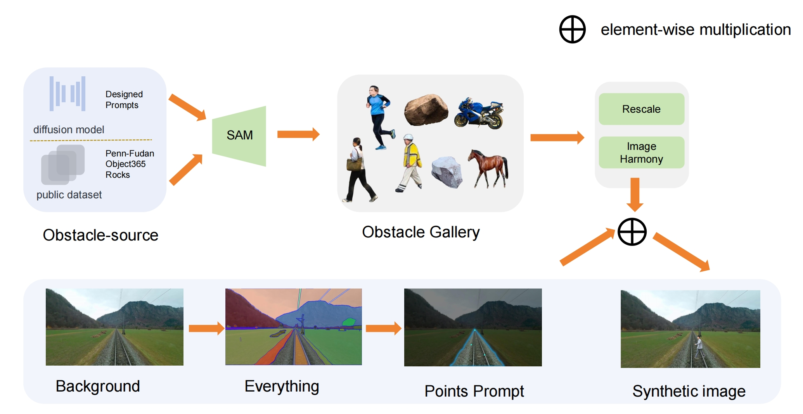
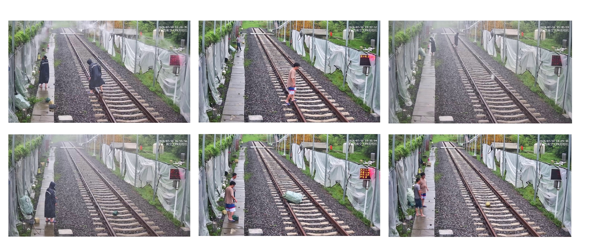

# SynRailObs

 A synthetic dataset on Obstacle detection in Railway scenario

## Introduction


## Download
data: [Kaggle](https://www.kaggle.com/datasets/qiushi910/synrailobs)

paper: [SynRailObs: A Synthetic Dataset for Obstacle Detection in Railway Scenarios](https://arxiv.org/pdf/2505.10784)

current obstacle categories:
* vehicles
* persons
* animals
* moto
Each directory contain images, masks and bounding box annotations(yolo format)。
## project structure
```
SynRailObs
|-images
  |- bg
  |- obj
|-models
  |-yolo5s.pt
  |-sam_vit_h.pth
|-sam-extract-obj.py
|-gen.ipynb
|-bezier-points.py
```
* **bg**: background images and corresponding json files, which are annotations
of railway areas  
* **obj**: potential obstacles.
* **sam-extract-obj.py**: extract obj from obj images based on points prompts  
* **gen.ipynb**: generate synthetic images based on obj and background images
* **bezier-points.py**: randomly generate bezier-points
## Auxilary Tools and datasets
* [Harmonizer](https://github.com/ZHKKKe/Harmonizer): Used to perform harmonization
with masks of foreground.
* [SAM](https://github.com/facebookresearch/segment-anything): tool to segment forefround.
* [stable-diffusion](https://huggingface.co/stabilityai/stable-diffusion-2-1): Generate synthetic obstacles.
* [DTD](https://www.robots.ox.ac.uk/~vgg/data/dtd/): Describable Textures Dataset.
* [obj365](https://www.objects365.org/overview.html): Serving as obstacle source.
* [Penn-Fudan Database for Pedestrian](https://www.cis.upenn.edu/~jshi/ped_html/): Serving as pedestrians sources
* [Rocks](https://www.kaggle.com/datasets/salmaneunus/rock-classification): rocks datasets.

## Pipeline


## Evaluation



| models                                                       | Params | mAP50 | mAP50:95 |
|--------------------------------------------------------------|--------|-------|----------|
| [Yolo5n](https://github.com/ultralytics/yolov5)              | 1.9    | 60.4  | 53.7     |
| [Yolo5s](https://github.com/ultralytics/yolov5)              | 7.2    | 62.7  | 55.4     |
| [Yolo5l](https://github.com/ultralytics/yolov5)              | 46.5   | 64.7  | 57.1     |
| [nanodet](https://github.com/RangiLyu/nanodet)               | 2.44   | 61.8  | 59.2     |
| [Faster-RCNN](https://github.com/jwyang/faster-rcnn.pytorch) | 44.3   | 63.8  | 58.7     |
| [Re-detr](https://docs.ultralytics.com/models/rtdetr/)       | 41.3   | 66.1  | 62.8     |

# Cite
If you use SynRailObs in your research, please cite our paper.
```
@article{guo2025synrailobs,
  title={SynRailObs: A Synthetic Dataset for Obstacle Detection in Railway Scenarios},
  author={Guo, Qiushi and Rambach, Jason},
  journal={arXiv preprint arXiv:2505.10784},
  year={2025}
}
```